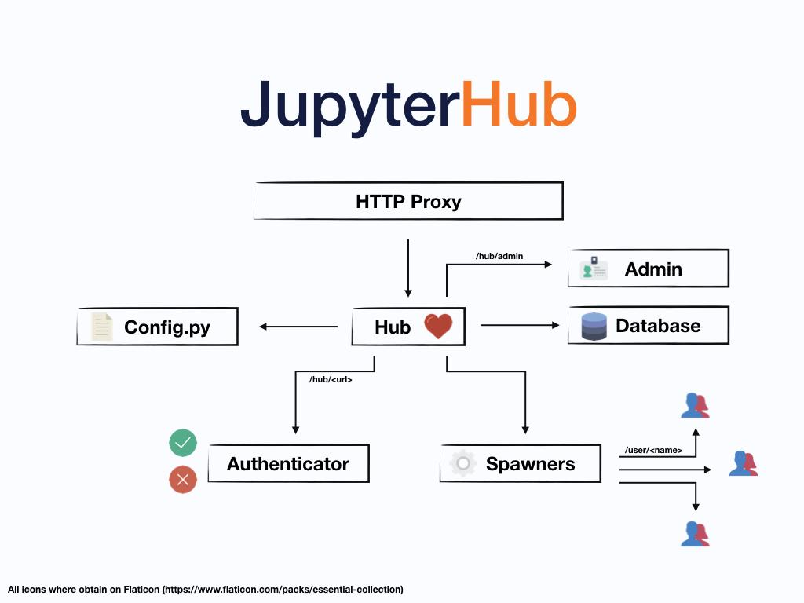

# Cyberinfrastructure
===================

## Datahub Cyberinfrastructure

## Overview

The Datahub is the core infrastructure that serves live computational
environments to all students for Data 8, Modules, and other Data Science
courses. Students can work entirely from the DataHub running in the
cloud. It is available to everyone on campus--- not limited just to
students enrolled in courses--- accessible via the standard campus
Single Sign-On (SSO) through
\<[[https://datahub.berkeley.edu/]](https://datahub.berkeley.edu/)\>.
It is built entirely on open source software that runs on commercial
cloud platforms and/or bare metal infrastructure managed by campus IT
staff and student infrastructure teams. The 3 key open source components
are JupyterHub, Kubernetes, and Docker integrated together as described
in [[Zero to Jupyterhub with
Kubernetes]](https://zero-to-jupyterhub.readthedocs.io/en/latest/).

**Datahub login screen:** https://datahub.berkeley.edu/hub/login

**JupyterHub infrastructure diagram**

## Target Audience

There are 3 key target audiences at the campus-level: students,
instructors, and *anyone* on campus. Initially the infrastructure was
created to support the instructors teaching Data 8 to 60 students in
Fall 2015, with the aim from the outset of scaling Data 8 to a much
larger size (1350 students as of Spring 2020), as well as to other
courses and use cases campus-wide beyond Data 8 itself. Designing for
scale from the start also allowed going beyond the campus audience to a
global audience with [[75,000 students enrolling in Data 8X on the edX
platform]](https://data.berkeley.edu/news/data-8-thrives-and-campus#main-inner:~:text=Data%208%20Extends%20Beyond%20Berkeley)
in Spring 2018.

For instructors this enabled an entirely new way of growing class sizes
and reaching students at scale. This alleviated the burden of supporting
and troubleshooting the differences in individual student laptops and
personal devices, as well as updating software and notebooks over time.
This was at the expense of instructors learning a new teaching toolset
and workflows.

For students this enabled full access to data science environments
through any device capable of running a web browser connected to the
internet from any location. This alleviated the burden and inequity of
requiring students to upgrade their personal computing devices to a
minimum standard which would have been a barrier to widespread student
participation. However this also introduced the requirement of an
internet connection to be able to use the cloud infrastructure any time
the student worked on class assignments, as there is no offline-mode
feature available for the Datahub.

For anyone on campus with an interest in Data Science, the Datahub
infrastructure was made available to everyone via standard campus Single
Sign-On (SSO) credentials. This lowered the barrier for anyone curious
to explore beyond the official course offerings without special access
or permissions. Instructors could try out the platform by themselves;
students could use the platform outside of class for their own projects
or [[directed group
study]](https://classes.berkeley.edu/content/2019-Fall-INFO-298-002-GRP-002);
researchers and scholars could experiment with how to use it in their
research workflows--- which spawned a Datahub variation called
[[BinderHub]](https://jupyter.org/binder) to share
reproducible interactive computing environments from code repositories
for other use cases such as workshops, research collaborations, and
reproducible scientific analysis. The creation of Binderhub for research
on publicly available clouds to anyone in the world via
\<[[https://mybinder.org/]](https://mybinder.org/)\> made it
easy to share educational materials outside UC Berkeley to allow anyone
at other institutions to interact with [[open data science
textbooks]](https://www.inferentialthinking.com/chapters/08/Functions_and_Tables.html).

## Links to Key Documents

-   [[Infrastructure \| Computing, Data Science, and
     Society]](https://data.berkeley.edu/external/infrastructure)

-   [[Introduction --- The Data Science Educator\'s Guide to Technology
     Infrastructure]](https://ucbds-infra.github.io/ds-course-infra-guide/intro.html)

    -   [[The Data 8 Tech Stack @
         Berkeley]](https://ucbds-infra.github.io/ds-course-infra-guide/jupyterhub/data8.html)

    -   [[JupyterHub
         Overview]](https://ucbds-infra.github.io/ds-course-infra-guide/jupyterhub/intro.html)

-   [[JupyterHub
     documentation]](https://jupyterhub.readthedocs.io/en/stable/index.html)

-   [[Zero to JupyterHub with
     Kubernetes]](https://zero-to-jupyterhub.readthedocs.io/en/latest/)

-   [[Jupyter Community
     Forum]](https://discourse.jupyter.org/)

    -   [[Category:
         JupyterHub]](https://discourse.jupyter.org/c/jupyterhub/10)

    -   [[Category: Special Topics \
         Education]](https://discourse.jupyter.org/c/special-topics/education/35)

-   [[Project Jupyter \| The Binder
     Project]](https://jupyter.org/binder)

-   [[Data 8 Thrives - On and Off Campus \| Computing, Data Science, and
     Society]](https://data.berkeley.edu/news/data-8-thrives-and-campus)

-   [[Data Science Education Community
     Newsletter]](https://datascienceeducation.substack.com/p/uc-berkeleys-data-science-newsletter)

-   Berkeley Infrastructure on Github

    -   [[https://github.com/berkeley-dsep-infra
         (Datahub)]](https://github.com/berkeley-dsep-infra)

    -   [[https://github.com/data-8/ (Course Materials and Legacy
         Infrastructure)]](https://github.com/data-8/)

    -   [[https://github.com/ucbds-infra/nbgitpuller (Notebook
         Distribution)]](https://github.com/ucbds-infra/nbgitpuller#nbgitpuller)

    -   [[https://github.com/yuvipanda (Core
         Developer)]](https://github.com/yuvipanda)

    -   [[https://github.com/ucbds-infra
         (Autograding)]](https://github.com/ucbds-infra)

## Autograding Cyberinfrastructure

## Overview

Autograding allows instructors to easily and efficiently grade student
assignments, and also lets students have a way to check their own
progress and ensure they are headed in the right direction on the way to
completing an assignment. It is an essential component of any scalable
computation-centered course that includes graded assignments. There are
several different options for autograding, several of which were
developed by faculty and students at UC Berkeley. Choosing an autograder
depends on the scale and particular requirements of a particular course.

## Target Audience

There are two main audiences: Instructors and teaching assistants who
need to grade student assignments, and the students themselves who want
to check their progress on an assignment and/or who are required to
submit their assignments for grading.

## Goals

Enable instructors to grade student assignments at scale.

Abstract away the autograding internals in a way that is compatible with
any instructor\'s assignment distribution and collection pipeline.

Enable local grading on an instructor laptop, as well as server-based
platforms of 3rd party learning management systems (LMSs).

Enable students to run public checks on their own machines.

Enable grading on a variety of computational formats including Jupyter
notebooks, Python scripts, R Jupyter Notebooks, R scripts, and Rmd
documents.

## Links to Key Documents

-   [[Infrastructure \| Computing, Data Science, and
     Society]](https://data.berkeley.edu/external/infrastructure)

-   [[The Data Science Educator\'s Guide to Technology
     Infrastructure]](https://ucbds-infra.github.io/ds-course-infra-guide/intro.html)

    -   [[Autograding
         Overview]](https://ucbds-infra.github.io/ds-course-infra-guide/autograding/intro.html)

    -   [[Otter
         Grader]](https://ucbds-infra.github.io/ds-course-infra-guide/autograding/otter.html)

    -   [[OkPy]](https://ucbds-infra.github.io/ds-course-infra-guide/autograding/okpy.html)

-   [[Otter-Grader
     Documentation]](https://otter-grader.readthedocs.io/en/latest/)

-   [[Otter Developer
     Slack]](https://otter-grader.slack.com/)

-   [[OkPy Website]](https://okpy.org/)

-   [[OkPy
     Publications]](https://okpy.org/about/publications/)

-   [[OkGrade
     Documentation]](https://okgrade.readthedocs.io/en/latest/)

-   Berkeley Autograding Infrastructure on Github

    -   [[https://github.com/ucbds-infra (Autograding Infrastructure
         Team)]](https://github.com/ucbds-infra)

    -   [[https://github.com/ucbds-infra/otter-grader]](https://github.com/ucbds-infra/otter-grader)

    -   [[https://github.com/ucbds-infra/ottr]](https://github.com/ucbds-infra/ottr)

    -   [[https://github.com/ucbds-infra/nbgitpuller]](https://github.com/ucbds-infra/nbgitpuller)

    -   [[https://github.com/ucbds-infra/Gofer-Grader]](https://github.com/ucbds-infra/Gofer-Grader)

    -   [[https://github.com/data-8/gofer\_service]](https://github.com/data-8/gofer_service)

    -   [[https://github.com/data-8/gofer\_submit]](https://github.com/data-8/gofer_submit)

    -   [[https://github.com/okpy]](https://github.com/okpy)

