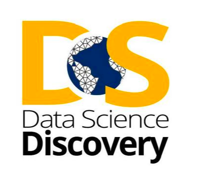

# Data Scholars Discovery Projects Seminar

## Overview

The Data Scholars Discovery Projects Seminar supports Data Scholars
students participating in the Discovery Research Projects. Data Scholar
students apply to the Discovery Projects program to be matched with one
of the current research opportunities. The Data Scholar students
participate in this seminar to support their participation in the
Discovery Project program.

Data Scholars are provided with an additional notation of their
participation in this program to contribute to their ranking in the
interview and assignment process within Discovery Projects.

The Seminar meets for 90 minutesonce a week.

## Target Audience

The seminar is for Data Scholar students completing the series of
courses. This course directly supports these students.

## Links to Key Documents

-   [[Spring 2020 Data Scholars Discovery
     Syllabus]](https://docs.google.com/document/d/1U19zT0CnZq6CUTFgabr4GSXGJntU0Agplj6wwLnKA2Y/edit)

## Program Description

This course focuses particularly on the development of Data Scholar
experience in the Discovery Program.
