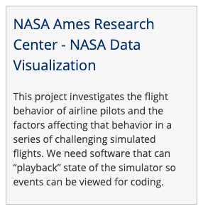
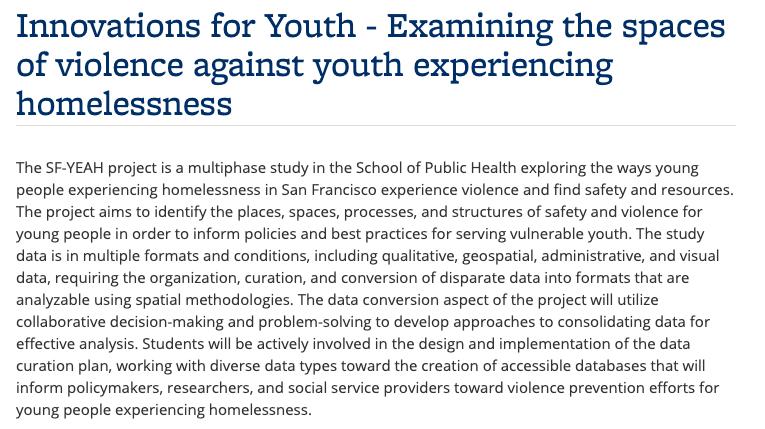
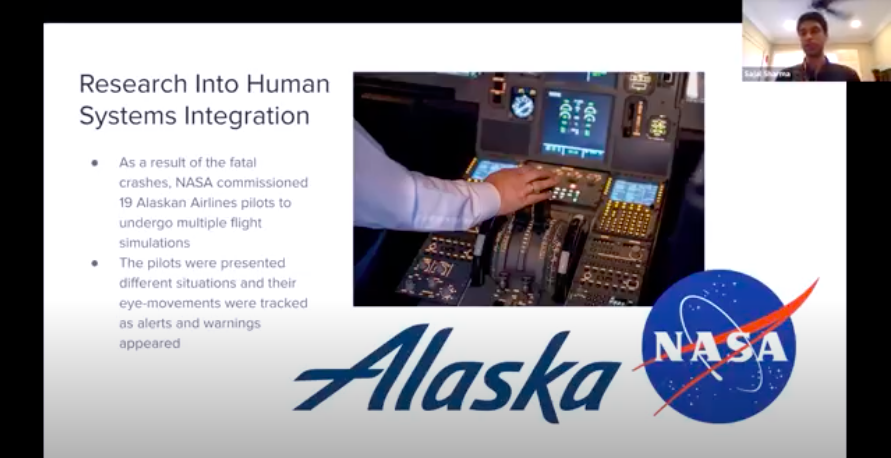

# Data Science Discovery Projects

## Overview

The Data Science Discovery Program connects undergraduates with
hands-on, team-based opportunities to contribute to data research
projects. Undergraduates collaborate with graduate and postdoctoral
students, collaborative research institutions, inventive projects, and
educational initiatives across UC Berkeley. The students' work in the
Discovery Projects earns them [[Undergraduate Research Apprenticeship
Program (URAP)]{.underline}](https://urap.berkeley.edu/) credits towards
their degree. The URAP program involves Berkeley undergraduates deeply
within the university's research life through direct connection with
mentors. The undergraduate students experience first-hand what it means
to be part of an intellectual community engaged in research.

Data science is an intrinsically interdisciplinary process with broad
reach, fast-scaling capacity, and a large pool of interested students
and projects. The Data Science Discovery Program, a joint effort of the
[[Berkeley Institute for Data
Sciences]{.underline}](https://bids.berkeley.edu/), Division of
Computing, Data Science, and Society, and the [[Undergraduate Research
Apprenticeship Program (URAP](http://urap.berkeley.edu/))]{.underline},
was created in 2015. The program was developed to offer undergraduates
the opportunity to build and apply data science skills and at the same
time to provide collaborators with skilled students to help address
their data challenges.

## Target Audience

The Data Science Discovery Experiences model seeks to identify, connect,
and scale access for undergraduate students, usually in their 3rd
semester or beyond, in the data science space. It does so by creating a
sustainable and diverse pipeline of projects by improving the matching
and database system, fine-tuning the training and consulting services
needed by graduate students, postdocs, and undergraduate research leads,
and expanding internal and public communication.

Research Partner Organizations (both in the Berkeley community and in
the broader community), faculty, and graduate students can all assist in
making research accessible to students. Social Impact efforts with
non-profit community groups offer the opportunity to help address
critical community issues.

## Goals

This program provides hands-on data science training and research
experience for undergraduate students, irrespective of major while
allowing students to earn academic credit in the process.

The discovery projects build connections via data science between campus
stakeholders/units and research partnerships with community social
impact organizations.

## Key Pedagogical or Curricular Strategies

This program uses active co-construction of cooperative learning (Chiu &
Linn 2011; Linn, 1995, 2000) by allowing students to work on genuine
projects relevant to the "real world." Graduate students supervise
undergraduates in near-peer teaching, as students work in small groups
(\~5) of other students. The flexibility that arises from students being
matched with projects based on their interests then enhances the
opportunity for students for their professional network.

## Key Diversity and Inclusion Practices and Strategies

The Division of Computing, Data Science, and Society---of which the Data
Science Discovery Projects program is a part---is committed to making
Data Science inviting, engaging, and respectful for people of diverse
identities, backgrounds, experiences, and perspectives. In our vision,
equity and inclusion are essential elements of educating a rising
generation of students, building a collaborative presence across campus,
and serving society. Data Science raises fundamental issues of justice
and participation in how it engages with human beings as sources of
data, as analysts, and as people affected by its products. In everything
the Division does, we are invested in working with our partners to shape
this new field to be equitable and inclusive.

[[Data Science Discovery
Projects]{.underline}](https://data.berkeley.edu/research/discovery)
create opportunities for students to experience sustained teamwork on
projects with high potential for collaborative impact. Diverse teams of
students with different backgrounds, interests, and levels of experience
are supported in working together. Collaboratives explicitly foster
students' work on long-term projects oriented toward societal impact.

The Division's student teams recruit from disciplines all across campus
to give undergraduates opportunities to lead, form connections, and
shape the Berkeley Data Science community. Teams take on projects in the
curriculum, internal operations, analytics, and more. Team structure
changes semester to semester based on where students see opportunities
for the Division to grow. A holistic, codified application review
process helps teams prioritize potential members with a passion for the
field and a belief in a growth mindset over pure technical skills and
experience.

## Links to Key Cyber Resources

-   Discovery Projects program
    > [[website]{.underline}](https://discovery.berkeley.edu/home)

-   Data Science Discovery Projects
    > [[website]{.underline}](https://data.berkeley.edu/research/discovery)

-   The Discovery Projects
    > [[Portfolio]{.underline}](https://data.berkeley.edu/spring-2020-discovery-projects)
    > from Spring 2020

-   [[Application
    > Form]{.underline}](https://docs.google.com/forms/d/e/1FAIpQLScyqO6oyiZ9DNOLVg11JNgrPMN-9gO7uZcRi9w7hFnMVyudkg/closedform)

-   Program Email [ds-discovery\@berkeley.edu]{.underline}

Narrative regarding links between Component Goals, Pedagogical
Strategies, and Central Elements of the Program

This program's goals are accomplished by matching students (based on the
research interests indicated in their applications) with project needs.
They work closely in small teams to develop collaboration skills and
applied knowledge. Being a part of a Discovery Project team brings
students into direct contact with organizations that require assistance
with data science problems.

## Example

Spring 2020 [[Project
Listings]{.underline}](https://data.berkeley.edu/discovery-project-list/spring-2020-discovery-projects)

{width="3.1666666666666665in"
height="3.3958333333333335in"}{width="2.9791666666666665in"
height="3.09375in"}

Partnership UCB department Partnership with NASA (Mountainview, CA)

Full [[Project
Description]{.underline}](https://data.berkeley.edu/spring-2020-discovery-projects/sf-yeah)

{width="6.5in" height="3.638888888888889in"}

Full [[Project
Description]{.underline}](https://data.berkeley.edu/spring-2020-discovery-projects/nasa-data-viz)

{width="5.145833333333333in"
height="2.8958333333333335in"}

{width="5.133178040244969in"
height="2.6406255468066493in"}

{width="5.166666666666667in"
height="2.8958333333333335in"}

## Best Practices for Variation Across Institutions

Currently, at Berkeley, \~ 30% of the interested 300--400 students are
matched with projects. Important factors to consider include (a) a
robust database (with an underlying matching algorithm), (b) having
staff to aid with the matching process, and (c) partner outreach.

## Other Implementation Notes

For partners, there are a few requests that they consider: (a) the level
of support your project needs, and (b) the level of support/mentorship
you can provide.

Level of support your project needs

-   Interview many students because some will drop out.

-   Students will all have different working and learning styles.

Level of support/mentorship you can provide

-   Your needs will be higher than you think and will take more time
    > than you think.

-   Create infrastructure for your students with specific tasks and
    > goals, clear expectations, and progress tracking.

## References

Chiu, J. L., & Linn, M. C. (2011). Knowledge integration and wise
engineering. Journal\
of Pre-College Engineering Education Research (J-PEER), 1(1), Article 2.

http://dx.doi.org/ 10.7771/2157-9288.1026

Linn, M. C. (1995). Designing computer learning environments for
engineering and

> computer science: The scaffolded knowledge integration framework.
> Journal of Science Education and Technology, 4(2), 103--126.
> doi:[[10.1007/BF02214052]{.underline}](https://www.researchgate.net/deref/http%3A%2F%2Fdx.doi.org%2F10.1007%2FBF02214052)

Linn, M. C. (2000). Designing the knowledge integration environment.
International

Journal of Science Education, 22(8), 781--796.

http://dx.doi.org/10.1080/095006900412275
